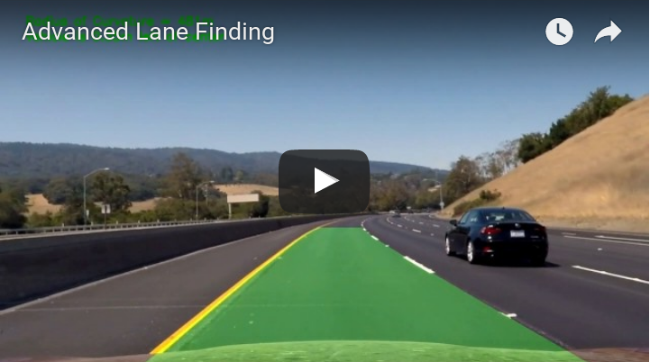
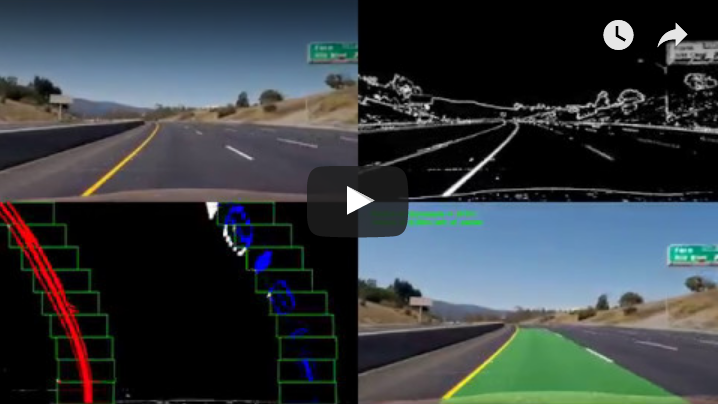

## Writeup Template

### You can use this file as a template for your writeup if you want to submit it as a markdown file, but feel free to use some other method and submit a pdf if you prefer.
[](https://www.youtube.com/watch?v=rZhzEHPJmtQ "Video Title")
---

**Advanced Lane Finding Project**

The goals / steps of this project are the following:

* Compute the camera calibration matrix and distortion coefficients given a set of chessboard images.
* Apply a distortion correction to raw images.
* Use color transforms, gradients, etc., to create a thresholded binary image.
* Apply a perspective transform to rectify binary image ("birds-eye view").
* Detect lane pixels and fit to find the lane boundary.
* Determine the curvature of the lane and vehicle position with respect to center.
* Warp the detected lane boundaries back onto the original image.
* Output visual display of the lane boundaries and numerical estimation of lane curvature and vehicle position.

[//]: # (Image References)

[image1]: ./readme_media/calibration2.png "Calibration"
[image2]: ./readme_media/small30/calibration2.png "Calibration"
[image3]: ./readme_media/small30/calibration2_undistorted.png "Undistorted Calibration"
[image4]: ./readme_media/small30/test1.png "Input"
[image5]: ./readme_media/small30/test1_result.png "Output"
[image6]: ./readme_media/small30/test1_01_undistort.png "Undistorted"
[image7]: ./readme_media/small30/test1_02_gray.png "Grayscale"
[image8]: ./readme_media/small30/test1_03_binary_sobelxy.png "Binary Sobel XY"
[image9]: ./readme_media/small30/test1_04_binary_s_of_hls.png "Binary Saturation"
[image10]: ./readme_media/small30/test1_05_binaries_combined.png "Binary Combination"
[image11]: ./readme_media/small30/test1_06_skewed_rectangle.png "Skewed Rectangle"
[image12]: ./readme_media/small30/test1_07_birds_eye_view.png "Birds Eye View"
[image13]: ./readme_media/small30/test1_09_histogram.png "Histogram"
[image14]: ./readme_media/small30/test1_10_sliding_window.png "Sliding Window"
[image15]: ./readme_media/small30/test1_11_colored_lane.png "Colored Lane"
[image16]: ./readme_media/test1_result.png "Output"
[image17]: ./readme_media/small30/placeholder_project_collage4.png "Video Result Image Pipeline"
[video1]: ./project_video.mp4 "Video"

---

### 1. Code And Data Setup


| What?         		|     File	        		| 
|:---------------------:|:-------------------------:| 
| code: main script     | bin/lane_line_detection.py| 
| code: helper module   | lib/helper_lane_lines.py 	|
| code: tracking class  | lib/line.py 				|
| calibration images    | etc/camera_cal/*			|
| input test images     | inp/img/test_images/*		|
| input test videos     | inp/vid/*					|
| output test images    | out/img/*					|
| output test videos    | out/vid/*					|


### 3. Usage

```
usage: lane_line_detection.py [-h] [--image [PATH]] [--video [PATH]]
                              [--startTime [INT]] [--endTime [INT]]
                              [--visLog INT] [--format STRING] [--outDir PATH]
                              [--calDir PATH]

a tool for detecting lane lines in images and videos

optional arguments:
  -h, --help         show this help message and exit
  --image [PATH]     image from a front facing camera. to detect lane lines
  --video [PATH]     video from a front facing camera. to detect lane lines
  --startTime [INT]  while developing the image pipeline it can be helpful to
                     focus on the difficult parts of an video, so to start at
                     processing at a certain time. e.g. 25 for 25 seconds
                     after begin.
  --endTime [INT]    to end processing video at a certain time, use this
                     argument. e.g. 30 for end processing 30 seconds after
                     video begin.
  --visLog INT       for debugging or documentation of the pipeline.
                     1=undistorted image 2=grayscale 3=binary mask magnitude
                     sobel xy 4=hls binary mask 5=combination of binary masks
                     6=unwarped binary with polygon 7=warped binary with
                     polygon 8=warped binary 9=histogram 10=detected lines
                     11=undistorted with detected lines 12=result with text
  --format STRING    to visualize single steps of the image pipeline, use this
                     argument. --format=collage4, --format=collage9 creates a
                     collage of images instead of the result image
  --outDir PATH      directory for output data. must not exist at call time.
  --calDir PATH      directory for camera calibration images. directory must
                     only contain chessboard 9x6 calibration images.

example call for processing an image:
python bin/lane_line_detection.py --image inp/img/test_images/test1.jpg

example call for processing an image. This outputs a certain step of the image pipeline:
python bin/lane_line_detection.py --image inp/img/test_images/test1.jpg --visLog 4

example call for processing a video:
python bin/lane_line_detection.py --image inp/vid/project_video.mp4

example call for processing only the part of a video between 38 and 45 seconds:
python bin/lane_line_detection.py --image inp/vid/project_video.mp4 --startTime 38 --endTime 45

example call for processing a video. This outputs a video of a certain step of the image pipeline:
python bin/lane_line_detection.py --image inp/vid/project_video.mp4 --visLog 4

example call for processing a video. This outputs a video of 4 important steps of the image pipeline:
python bin/lane_line_detection.py --image inp/vid/project_video.mp4 --format collage4

example call for processing a video. This outputs a video of 9 important steps of the image pipeline:
python bin/lane_line_detection.py --image inp/vid/project_video.mp4 --format collage9
```
### 4. Camera Calibration

The code for this step is contained in the 'calibrateCamera' function in the lines 852 through 923 of the file 'lib/helper_lane_lines.py'.  

I start by preparing "object points", which will be the (x, y, z) coordinates of the chessboard corners in the world. Here I am assuming the chessboard is fixed on the (x, y) plane at z=0, such that the object points are the same for each calibration image.  Thus, `objp` is just a replicated array of coordinates, and `objpoints` will be appended with a copy of it every time I successfully detect all chessboard corners in a test image.  `imgpoints` will be appended with the (x, y) pixel position of each of the corners in the image plane with each successful chessboard detection.  

I then used the output `objpoints` and `imgpoints` to compute the camera calibration and distortion coefficients using the `cv2.calibrateCamera()` function.  I applied this distortion correction to a calibration image itself using the `cv2.undistort()` function and obtained this result: 

![alt text][image2]    ![alt text][image3]

After a successful calibration procedure, the return value, camera calibration matrix, distortion coefficients, the rotation and the translation vectors (ret, mtx, dist, rvecs, tvecs) are written to a pickle file '.calibration.pkl' and placed in the directory, where the calibration images reside. The next time the program is called with the same calibration images, there won't be the need to go through the calibration effort again. Instead the precalculated calibration parameters will be read from the pickle file.

### 5. Pipeline (single images)

The image pipeline is shaped by 12 image processing steps. The high level code for the image pipeline is contained in the 'laneLinePipeline' function in the lines 64 through 255 of the file 'lib/helper_lane_lines.py'.
The pipeline transforms an input image to an image with the found lane in it.

![Input][image4]    ![Output][image5]

#### Step 1. Distortion Correction

This step uses the the `cv2.undistort` function with the camera calibration matrix and the distortion coefficients to undistort the image (line 92 of 'lib/helper_lane_lines.py').

![Input][image4]    ![Undistort][image6]

#### Step 2. Grayscale Image

The Image is converted to grayscale. This version is needed for some subsequent processing steps (line 102 of 'lib/helper_lane_lines.py').

![Undistort][image6]    ![Grayscale][image7]

#### Step 3. Binary Mask Of Sobel Operator

The Magnitude Sobel-xy-Operator is performed on the grayscale image. This results in a binary mask image (line 113 of 'lib/helper_lane_lines.py')

![Grayscale][image7]    ![Binary Sobel xy][image8]

#### Step 4. Binary Mask Of Saturation

The undistorted RGB image is converted to the HLS colorspace. From the HLS colorspace, the thresholded S-Channel results in a binary mask image (line 124 of 'lib/helper_lane_lines.py').

![Binary Sobel][image8]    ![Binary Saturation][image9]

#### Step 5. Combinated Binary Mask Of Sobel And Saturation

The binary masks from step 3 and step 4 are combinated in line 135 of 'lib/helper_lane_lines.py'.

![Binary Combination][image10]

#### Step 6. Perspectively Skewed Rectangle

A perspectively skewed rectangle is placed on the image in line 146 of 'lib/helper_lane_lines.py'.

![Binary Combination][image10]    ![Skewed Rectangle][image11]

#### Step 7/8. Birds Eye View

The code for my perspective transform includes a function called `transformToBirdsView()`, which appears in lines 1 through 8 in the file `example.py` (output_images/examples/example.py) (or, for example, in the 3rd code cell of the IPython notebook).
I hardcoded the source and destination points in the following manner:

This resulted in the following source and destination points:

| Source        | Destination   | 
|:-------------:|:-------------:| 
| 200, 720      | 250, 720      | 
| 1080, 720     | 1030, 720     |
| 685, 450      | 1030, 0       |
| 595, 450      | 250, 0        |

I verified that my perspective transform was working as expected by drawing the `src` and `dst` points onto a test image and its warped counterpart to verify that the lines appear parallel in the warped image. (line 146 of 'lib/helper_lane_lines.py').

![Skewed Rectangle][image11]    ![Birds Eye View][image12]

#### Step 9. Histogram

The Pixels in the lower half of the warped combined binary image are counted with a histogram. The lines are at these x positions where the most white (binary!) pixels are found (line 173 through 179 of 'lib/helper_lane_lines.py').

![Birds Eye View][image12]    ![Histogram][image13]

#### Step 10. Detecting Lane Lines

From step 9 we know the x-positions of the lines in the lower half of the image. From there we detect the upper area of the lines with a sliding window approach. In each y-bin the bright pixels are counted and the mean x-position is where the line is situated in the current window. Then we fit the lane lines with a 2nd order polynomial (line 193 through 198 of 'lib/helper_lane_lines.py').

![Sliding Window][image14]

#### Step 11. Overlay Detected Lines

The found lines and the lane is being drawn onto the undistorted rgb image (line 228 of 'lib/helper_lane_lines.py'). 

![Colored Lane][image15]

#### Step 12. Overlay Text - Result

The curvature of the detected lane and the vehicle-deviation from the lane center is being calculated and written onto the image (line 244 of 'lib/helper_lane_lines.py'). 

![Output][image16]

### Pipeline (video)

#### Result Of Project Video

You find the result of project video here [out/vid/project_output.mp4](out/vid/project_output.mp4)

[](https://www.youtube.com/watch?v=EVYzt8sg7H4 "Advanced Lane Finding")

#### Result Of Project Video With Image Pipeline Visualization

You find the result of project video with pipeline visualization here [out/vid/project_collage4_output.mp4](out/vid/project_collage4_output.mp4)

[](https://www.youtube.com/watch?v=1vQLGEmQ4lI "Advanced Lane Finding Image Pipeline")

### Discussion

#### 1. Problems / Issues

One problem that I experienced was, that in the project video the left line jumped to the left when the vehicle drove over the brighter road surface.

I solved that problem by changing the destination points in the step 7 "Birds Eye View". When transforming the image I zoomed more in and got rid of the irritating pixels that made my line jump.

Another problem was, that in some frames of the project video the right line has been improperly detected and wandered off even beyond the left line.

I solved this problem by instead of working with the fitted polynomial, I calculated the mean of the last 5 frames. This solved the 'jumping-lane' problem.

#### 2. Where Will The Pipeline Likely Fail?

My current pipeline will fail on roads with color edges that run parallel to the lane lines, like in video inp/vid/challenge.mp4. These edges will be falsely detected as lane lines and make the pipeline fail.

#### 3. Improve Robustness

These improvements would make the pipeline more robust:

* tracking the lane width could detect errors and jumping lines
* if only one line wanders off or jumps and the other one stays pretty much in the same place, this line could use the polyfit coefficients of the correct line to augment a line for some frames.
